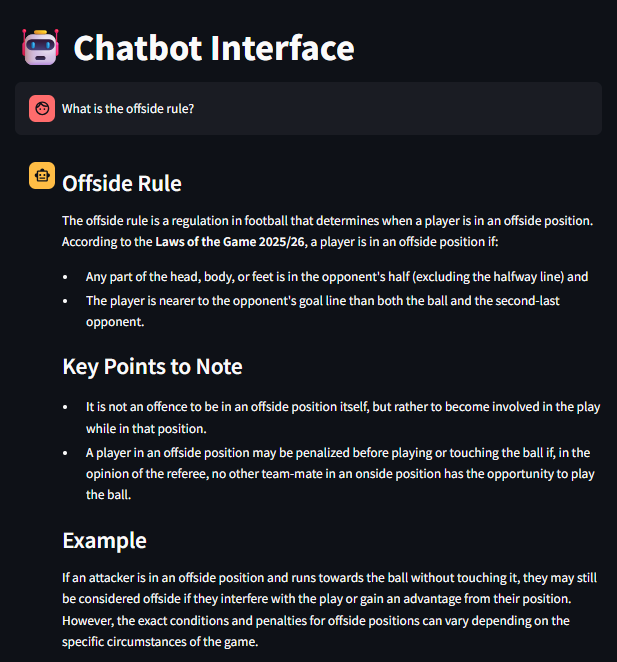

# Football Rules Chatbot (RAG + GROQ + FastAPI + WebSocket)

This project is an AI-powered, real-time chatbot assistant that uses Retrieval-Augmented Generation (RAG) for domain-specific answers. It is built on Groq's LLM for fast and efficient inference, integrates a FAISS-based vector database for context-aware responses, and leverages FastAPI for handling WebSocket communication with the frontend. The backend uses the websockets library for persistent LLM interaction, ensuring seamless real-time conversations.

---

## Setting Up the Project

### Install Dependencies

```bash
pip install -r requirements.txt
```

### Create a .env File

Create a .env file in the root directory of your project and add the following variables:

```
GROQ_API_KEY=your_groq_api_key
GROQ_MODEL=llama-3.3-70b-versatile
```

## Testing Groq Agent
Start the Groq Agent WebSocket Server:

```bash
python agent.py
```

Start the FastAPI app:

```bash
uvicorn main:app --reload --port 8080
```

Start the Streamlit Interface:

```bash
streamlit run streamlit\main.py
```

## Example Conversation
